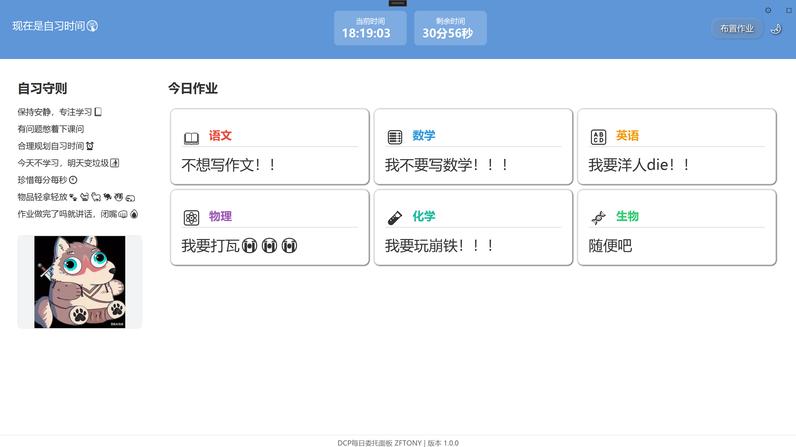
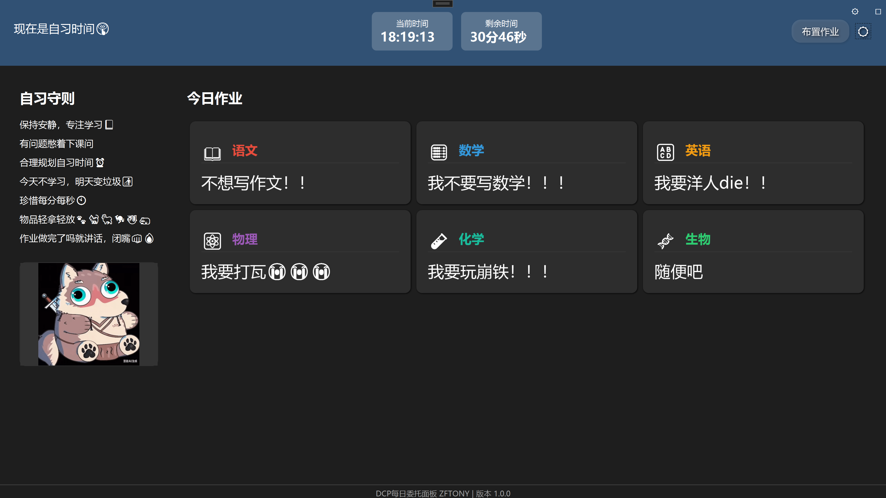
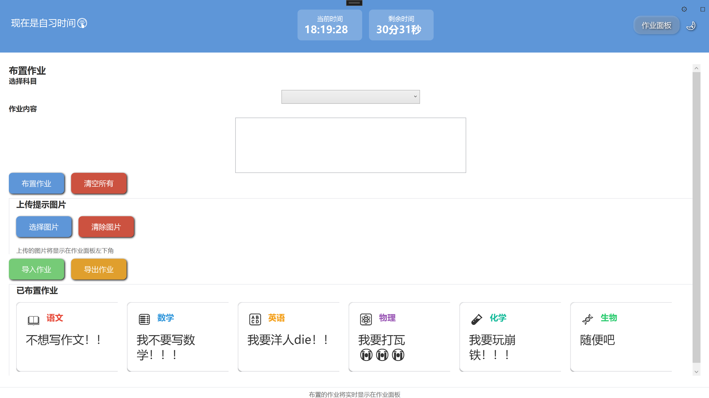
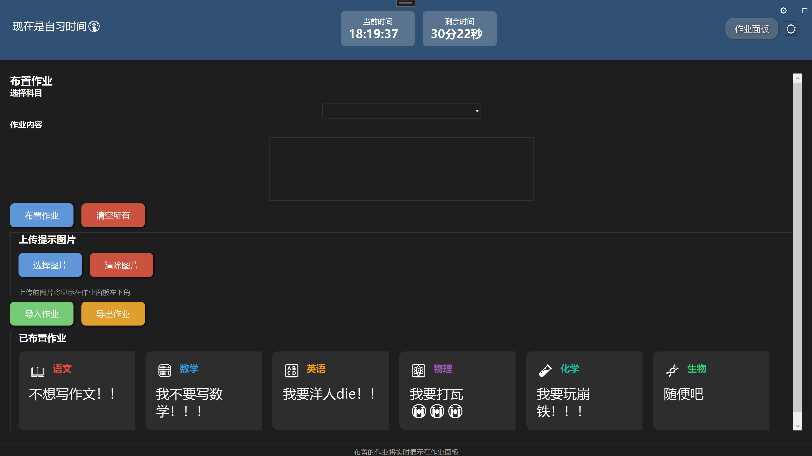
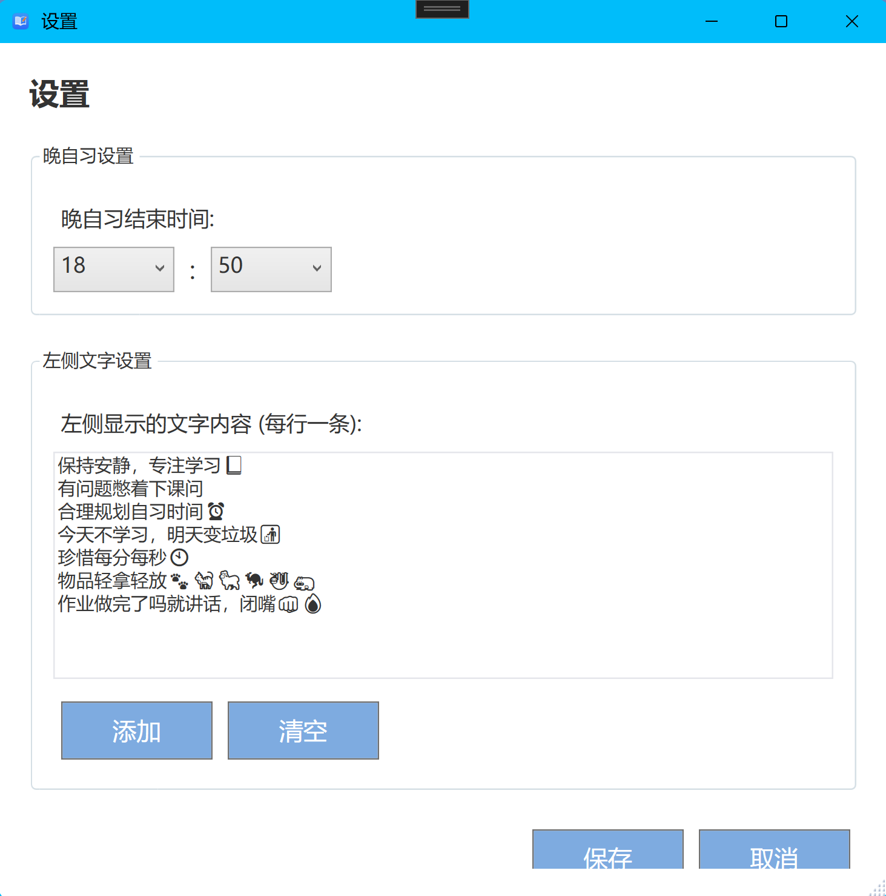
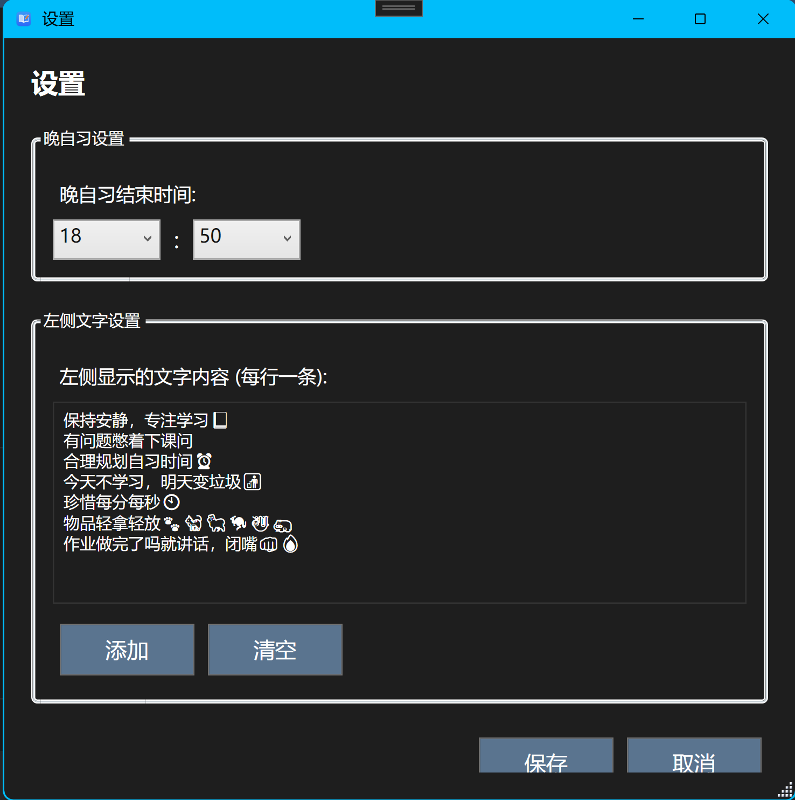

# <image src="Assets/DCP 图标.svg" height="28" width="28"/> DCP每日委托面板

DCP每日委托面板是一个简洁实用的作业管理工具，专为教师和学生设计，提供作业展示、布置和管理功能。

## 功能特点

*   **双界面设计**：包含作业面板和布置面板两个界面，可轻松切换
*   **作业展示**：清晰展示各科目作业内容
*   **时间显示**：实时显示当前时间和自习剩余时间
*   **主题切换**：支持浅色和深色两种主题模式
*   **图片上传**：可上传提示图片，增强整活效果
*   **数据导入导出**：支持作业数据的导入和导出功能
*   **全屏模式**：支持切换到全屏模式，提升展示效果

###### ~~活是必须要整的，人不整活了，那不就die了吗~~

## 界面预览

> 当前版本为测试版本，不代表最终品质

### 主界面

##### 1. 作业面板【浅色】

##### 2. 作业面板【深色】

查看更多软件截图……

### 作业布置

##### 1. 布置面板【浅色】

##### 2. 布置面板【深色】

### 设置【更多自定义】

##### 1. 设置面板【浅色】

##### 2. 设置面板【深色】

### 作业面板界面

*   显示当前时间和剩余时间
*   展示自习守则和整活图片
*   以卡片形式展示各科目作业

### 作业布置界面

*   提供科目选择和作业内容编辑
*   支持图片上传和管理
*   展示已布置的作业列表
*   提供导入导出功能

## 开始使用

**首先，请确保您的设备满足以下推荐需求：**

- Windows 10 及以上版本的系统
- 安装 [.NET 8.0 桌面运行时](https://dotnet.microsoft.com/zh-cn/download/dotnet/thank-you/runtime-desktop-8.0.7-windows-x64-installer)

你可以用以下地址下载到本软件，若网速过慢，建议使用镜像网站进行下载
- [GitHub Releases](https://github.com/BearWhite-Z/Daily-Commission-Panel/releases/)

下载完成后，将软件压缩包解压到一个独立的文件夹，双击任意一个安装包根据提示进行安装 **++（运行路径不能有中文）++** ，完成安装后即可在桌面上双击快捷方式运行程序。

### 作业面板

1.  打开应用程序，默认显示作业面板界面
2.  查看各科作业内容
3.  查看当前时间和剩余时间 *（结束时间可在设置中自定义，默认21:50）*
4.  查看自习守则 *(内容可在设置中自定义)*

### 布置作业

1.  点击界面右上角的 *"布置作业"* 按钮切换到作业布置界面
2.  先选择科目，再输入作业内容
3.  （可选）上传图片 *~~（可整小活）~~*
4.  点击下方 *"布置作业"* 按钮提交作业
5.  可使用 *"导入作业"* 和 *"导出作业"* 功能管理作业数据
6.  点击 *"作业面板"* 按钮返回作业面板界面

### 深/浅色模式切换

*   点击界面右上角的主题切换按钮（☀/🌙）可切换浅色/深色主题

### 全屏沉浸模式

*   点击界面右上角的全屏按钮（□）可切换到全屏
*   在全屏模式下，点击按钮（◻）可退出全屏

## 开发环境

*   操作系统：Windows
*   开发工具：Visual Studio 2022
*   开发语言：C#
*   框架：WPF (.NET Framework)

## 项目结构

    Daily-Commission-Panel/
    ├── App.xaml               # 应用程序入口XAML
    ├── App.xaml.cs            # 应用程序入口代码
    ├── MainWindow.xaml        # 主窗口XAML
    ├── MainWindow.xaml.cs     # 主窗口代码
    ├── Models/                # 数据模型
    │   └── Settings.cs        # 设置模型
    ├── Properties/            # 项目属性
    │   ├── PublishProfiles/   # 发布配置
    │   ├── Settings.Designer.cs # 设置设计器文件
    │   └── Settings.settings  # 设置文件
    ├── README.md              # 项目说明文档
    ├── SettingsWindow.xaml    # 设置窗口XAML
    ├── SettingsWindow.xaml.cs # 设置窗口代码
    └── Themes/                # 主题文件
        ├── DarkTheme.xaml     # 深色主题
        └── LightTheme.xaml    # 浅色主题

## 版本历史

*   v1.0-beta.1 (当前版本)
    *   初始发布
    *   实现布置作业及作业面板双界面设计
    *   添加作业管理功能
    *   支持浅色/深色双主题切换

## 作者信息

*   作者：BearWhite-Z
*   联系邮箱：\[<zf081225@outlook.com>]

## 

DCP每日委托面板 | ZFTONY 